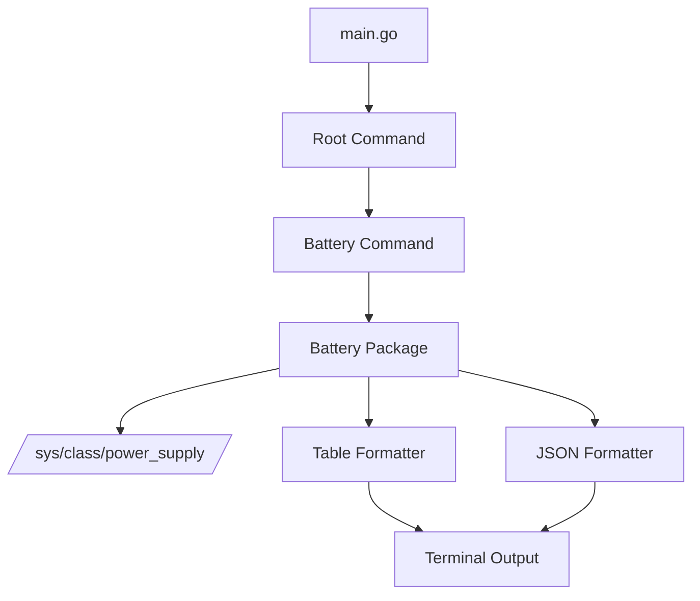

# Linux Toolkit - Battery Stats CLI Tool

## Project Overview
Create a Golang CLI utility named `linux-toolkit` that provides useful Linux tools. The initial implementation will include a battery stats command that displays detailed battery information.

## Requirements Summary
- **CLI Name**: `linux-toolkit`
- **Framework**: Cobra (popular, feature-rich)
- **Output Formats**: Table (default) and JSON (via `--format` flag)
- **Battery Information**: Capacity, status, voltage, current, power, health, and time remaining

## Project Structure

```
linux-toolkit/
├── cmd/
│   ├── root.go          # Root command
│   └── battery.go       # Battery stats subcommand
├── pkg/
│   └── battery/
│       ├── battery.go   # Battery data structures and reader
│       └── output.go    # Output formatting (table/JSON)
├── go.mod               # Go module definition
├── go.sum               # Go module checksums
├── main.go              # Entry point
└── README.md            # Usage documentation
```

## Architecture



## Component Details

### 1. Main Entry Point (`main.go`)
- Initialize the root command
- Execute the CLI

### 2. Root Command (`cmd/root.go`)
- Cobra root command setup
- Global flags (if needed)
- CLI version and description

### 3. Battery Command (`cmd/battery.go`)
- Subcommand: `linux-toolkit battery`
- Flags:
  - `--format` (table|json) - Output format
  - `--battery` (string) - Specific battery device name (optional, default auto-detect)

### 4. Battery Package (`pkg/battery/`)

#### `battery.go` - Data Structures
```go
type BatteryInfo struct {
    Name         string  // Battery device name (e.g., BAT0)
    Capacity     int     // Capacity percentage
    Status       string  // Charging/Discharging/Full/Unknown
    Voltage      float64 // Voltage in volts
    Current      float64 // Current in amps
    Power        float64 // Power in watts
    Health       string  // Battery health status
    TimeRemaining string // Estimated time remaining
}

type BatteryReader interface {
    ReadBattery(deviceName string) (*BatteryInfo, error)
    ListBatteries() ([]string, error)
}
```

#### `battery.go` - Linux Implementation
- Read from `/sys/class/power_supply/` directory
- Parse files:
  - `capacity` - Capacity percentage
  - `status` - Charging/Discharging/Full
  - `voltage_now` - Current voltage (μV)
  - `current_now` - Current draw (μA)
  - `power_now` - Current power (μW)
  - `health` - Battery health
  - `energy_full` - Full capacity (μWh)
  - `energy_now` - Current capacity (μWh)

#### `output.go` - Formatters
- `PrintTable(battery *BatteryInfo)` - Human-readable table
- `PrintJSON(battery *BatteryInfo)` - JSON output

## Usage Examples

```bash
# Display battery stats in table format (default)
linux-toolkit battery

# Display battery stats in JSON format
linux-toolkit battery --format json

# Display specific battery
linux-toolkit battery --battery BAT1

# Show help
linux-toolkit battery --help
linux-toolkit --help
```

## Sample Output

### Table Format
```
Battery Information
===================
Device:       BAT0
Capacity:     85%
Status:       Discharging
Voltage:      11.8 V
Current:      2.1 A
Power:        24.8 W
Health:       Good
Time Remaining: ~2h 15m
```

### JSON Format
```json
{
  "name": "BAT0",
  "capacity": 85,
  "status": "Discharging",
  "voltage": 11.8,
  "current": 2.1,
  "power": 24.8,
  "health": "Good",
  "timeRemaining": "2h 15m"
}
```

## Dependencies
- `github.com/spf13/cobra` - CLI framework
- Go standard library

## Future Extensions
The modular design allows easy addition of new tools:
- `linux-toolkit cpu` - CPU stats
- `linux-toolkit memory` - Memory stats
- `linux-toolkit disk` - Disk usage
- `linux-toolkit network` - Network stats
- etc.
