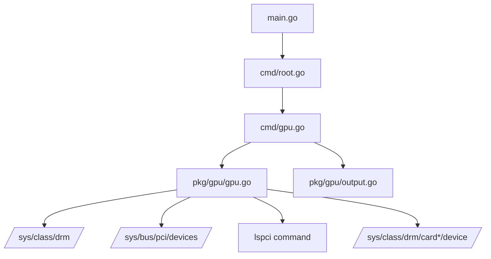

# GPU Information Tool Implementation Plan

## Overview
Add a new CLI tool to display verbose GPU information. The tool will follow the same architectural pattern as the existing battery, disk, and CPU tools.

## Architecture



## Data Structures

### GPUInfo Struct
```go
type GPUInfo struct {
    // Basic Device Information
    CardName         string   `json:"cardName"`         // Card name (e.g., card0)
    DeviceName       string   `json:"deviceName"`       // Device name (e.g., /dev/dri/card0)
    Driver           string   `json:"driver"`           // Driver name
    Vendor           string   `json:"vendor"`           // Vendor name (e.g., NVIDIA, AMD, Intel)
    VendorID         string   `json:"vendorId"`         // Vendor ID (hex, e.g., 10de)
    DeviceID         string   `json:"deviceId"`         // Device ID (hex)
    SubsystemVendor  string   `json:"subsystemVendor"`  // Subsystem vendor
    SubsystemDevice  string   `json:"subsystemDevice"`  // Subsystem device
    Class            string   `json:"class"`            // Device class
    Revision         string   `json:"revision"`         // Revision number

    // Display Information
    Enabled          bool     `json:"enabled"`          // Whether the GPU is enabled
    Status           string   `json:"status"`           // Status string
    Connectors       []string `json:"connectors"`       // Available connectors (HDMI, DP, etc.)
    EnabledConnectors []string `json:"enabledConnectors"` // Currently enabled connectors
    Modes            []string `json:"modes"`            // Supported display modes

    // Memory Information
    VRAMSize         uint64   `json:"vramSize"`         // VRAM size in bytes
    VRAMUsed         uint64   `json:"vramUsed"`         // VRAM used in bytes
    VRAMFree         uint64   `json:"vramFree"`         // VRAM free in bytes
    GARTSize         uint64   `json:"gartSize"`         // GART aperture size
    GARTUsed         uint64   `json:"gartUsed"`         // GART used

    // Clock Information
    CoreClock        uint64   `json:"coreClock"`        // Core clock in MHz
    MemoryClock      uint64   `json:"memoryClock"`      // Memory clock in MHz
    MaxCoreClock     uint64   `json:"maxCoreClock"`     // Max core clock in MHz
    MaxMemoryClock   uint64   `json:"maxMemoryClock"`   // Max memory clock in MHz

    // Power Information
    PowerUsage       uint64   `json:"powerUsage"`       // Power usage in mW
    PowerLimit       uint64   `json:"powerLimit"`       // Power limit in mW
    PowerCap         uint64   `json:"powerCap"`         // Power cap in mW

    // Temperature Information
    Temperature      float64  `json:"temperature"`       // GPU temperature in Celsius
    TemperatureCrit  float64  `json:"temperatureCrit"`  // Critical temperature
    FanSpeed        uint64   `json:"fanSpeed"`         // Fan speed in RPM
    FanSpeedPercent float64  `json:"fanSpeedPercent"`  // Fan speed percentage

    // Utilization Information
    GPUUtilPercent  float64  `json:"gpuUtilPercent"`   // GPU utilization percentage
    MemoryUtilPercent float64 `json:"memoryUtilPercent"` // Memory utilization percentage

    // Bus Information
    BusID           string   `json:"busId"`            // PCI bus ID (e.g., 0000:01:00.0)
    BusWidth        string   `json:"busWidth"`         // Bus width (e.g., x16)
    PCIEGen         string   `json:"pcieGen"`          // PCIe generation
    MaxPCIEGen      string   `json:"maxPcieGen"`       // Maximum PCIe generation

    // Firmware Information
    VBIOSVersion    string   `json:"vbiosVersion"`     // VBIOS version
    FirmwareVersion string   `json:"firmwareVersion"`  // Firmware version

    // Additional Information
    DevicePath      string   `json:"devicePath"`       // Full device path
    SysfsPath       string   `json:"sysfsPath"`        // Sysfs path
    IsPrimary       bool     `json:"isPrimary"`        // Whether this is the primary GPU
    GPUType         string   `json:"gpuType"`          // GPU type (discrete, integrated)
    ComputeUnits    uint64   `json:"computeUnits"`     // Number of compute units (AMD)
    CUDAcores       uint64   `json:"cudaCores"`        // Number of CUDA cores (NVIDIA)
    Shaders         uint64   `json:"shaders"`          // Number of shader units
    TextureUnits    uint64   `json:"textureUnits"`     // Number of texture units
    ROPs            uint64   `json:"rops"`             // Number of ROPs
}
```

### ConnectorInfo Struct
```go
type ConnectorInfo struct {
    Name       string `json:"name"`       // Connector name (e.g., HDMI-A-1)
    Type       string `json:"type"`       // Connector type (HDMI, DP, DVI, etc.)
    Status     string `json:"status"`     // Connected/Disconnected
    Enabled    bool   `json:"enabled"`    // Whether enabled
    Properties map[string]string `json:"properties"` // Additional properties
}
```

## Implementation Steps

### Step 1: Create pkg/gpu/gpu.go
Create the core GPU reading logic with the following components:

1. **GPUReader struct** - Main reader for GPU information
   - `sysfsDrmPath: /sys/class/drm/`
   - `sysfsPciPath: /sys/bus/pci/devices/`
   - `lspciPath: /usr/bin/lspci`

2. **Methods to implement:**
   - `ListGPUs() ([]string, error)` - List all available GPU cards
   - `ReadGPU(cardName string) (*GPUInfo, error)` - Read all GPU information
   - `ReadBasicInfo(cardName string) (*GPUInfo, error)` - Read basic device info from sysfs
   - `ReadPCIInfo(cardName string) (*GPUInfo, error)` - Read PCI device information
   - `ReadLSPCIInfo(cardName string) (*GPUInfo, error)` - Parse lspci output
   - `ReadMemoryInfo(cardName string) (*GPUInfo, error)` - Read memory information
   - `ReadClockInfo(cardName string) (*GPUInfo, error)` - Read clock information
   - `ReadPowerInfo(cardName string) (*GPUInfo, error)` - Read power information
   - `ReadTemperatureInfo(cardName string) (*GPUInfo, error)` - Read temperature
   - `ReadUtilizationInfo(cardName string) (*GPUInfo, error)` - Read utilization
   - `ReadBusInfo(cardName string) (*GPUInfo, error)` - Read bus information
   - `ReadFirmwareInfo(cardName string) (*GPUInfo, error)` - Read firmware info
   - `ReadConnectors(cardName string) ([]ConnectorInfo, error)` - Read connector info
   - `DetectVendor(vendorID string) string` - Detect vendor from ID

3. **Helper methods:**
   - `getCardSysfsPath(cardName string) string` - Get sysfs path for card
   - `getDevicePCIPath(cardName string) (string, error)` - Get PCI device path
   - `parseHexFile(path string) (uint64, error)` - Parse hex value from file
   - `parseDecFile(path string) (uint64, error)` - Parse decimal value from file
   - `readStringFile(path string) (string, error)` - Read string from file
   - `formatBytes(bytes uint64) string` - Format bytes to human-readable
   - `formatMHz(mHz uint64) string` - Format MHz to human-readable
   - `getVendorName(vendorID string) string` - Map vendor ID to name

### Step 2: Create pkg/gpu/output.go
Create output formatting logic:

1. **OutputFormat type** - Table and JSON formats (same as battery/disk/cpu)

2. **Functions to implement:**
   - `Print(gpu *GPUInfo, format OutputFormat) error`
   - `PrintTable(gpu *GPUInfo)` - Human-readable table with colors and emojis
   - `PrintJSON(gpu *GPUInfo) error` - JSON output
   - `PrintMultipleGPUs(gpus []*GPUInfo)` - Print all GPUs in compact table

3. **Helper functions:**
   - `getVendorIcon(vendor string) string` - Emoji based on vendor
   - `getVendorColor(vendor string) *color.Color` - Color based on vendor
   - `getUtilColor(percent float64) *color.Color` - Color based on utilization
   - `getTempColor(temp float64) *color.Color` - Color based on temperature
   - `printField()` - Consistent field formatting
   - `printSection()` - Section header formatting

### Step 3: Create cmd/gpu.go
Create the CLI command:

1. **Command flags:**
   - `--card, -c` - Specific GPU card (e.g., card0)
   - `--format, -f` - Output format (table|json)
   - `--all, -a` - Show all GPUs
   - `--show-connectors` - Show connector information
   - `--show-modes` - Show supported display modes

2. **Command logic:**
   - List all GPUs or read specific GPU
   - Optionally show connector/mode details
   - Display in requested format

### Step 4: Update cmd/root.go
- Add GPU command to rootCmd using `rootCmd.AddCommand(gpuCmd)`

### Step 5: Update README.md
- Add documentation for the new GPU command
- Include usage examples
- Show table and JSON output formats
- Document all command flags

## Linux System Information Sources

### /sys/class/drm/
Main source for DRM device information:
- `card0/` - Card directory
- `card0/device/` - Device information
- `card0/device/driver/` - Driver information
- `card0/device/vendor` - Vendor ID
- `card0/device/device` - Device ID
- `card0/device/subsystem_vendor` - Subsystem vendor
- `card0/device/subsystem_device` - Subsystem device
- `card0/device/revision` - Revision
- `card0/device/enable` - Enable status
- `card0/modes` - Supported display modes
- `card0/status` - Card status
- `card0/edid` - EDID data (if available)

### /sys/bus/pci/devices/
PCI device information:
- `0000:01:00.0/vendor` - Vendor ID
- `0000:01:00.0/device` - Device ID
- `0000:01:00.0/class` - Device class
- `0000:01:00.0/uevent` - Device uevent data
- `0000:01:00.0/numa_node` - NUMA node
- `0000:01:00.0/local_cpus` - Local CPUs
- `0000:01:00.0/irq` - IRQ number
- `0000:01:00.0/driver/` - Driver information

### lspci command
Comprehensive PCI device information:
- `lspci -v -s <busid>` - Detailed info for specific device
- `lspci -nn -d <vendor>:<device>` - List by vendor/device
- Output includes: vendor name, device name, driver, subsystem info

### Vendor-specific sysfs paths

#### NVIDIA (if available)
- `card0/device/gpu_busy_percent` - GPU utilization
- `card0/device/mem_busy_percent` - Memory utilization
- `card0/device/gpu_temp` - GPU temperature
- `card0/device/fan_speed` - Fan speed
- `card0/device/pwm` - PWM value
- `card0/device/power/control` - Power control
- `card0/device/power/limit` - Power limit

#### AMD (if available)
- `card0/device/gpu_busy_percent` - GPU utilization
- `card0/device/mem_busy_percent` - Memory utilization
- `card0/device/gpu_temp` - GPU temperature
- `card0/device/fan_speed` - Fan speed
- `card0/device/pp_dpm_sclk` - Current core clock
- `card0/device/pp_dpm_mclk` - Current memory clock
- `card0/device/mem_info_vram_total` - Total VRAM
- `card0/device/mem_info_vram_used` - Used VRAM

#### Intel (if available)
- `card0/device/gt_act_freq_mhz` - Current frequency
- `card0/device/gt_cur_freq_mhz` - Current frequency
- `card0/device/gt_boost_freq_mhz` - Boost frequency
- `card0/device/gt_RP0_freq_mhz` - Max frequency
- `card0/device/gt_RPn_freq_mhz` - Min frequency
- `card0/device/gt_cur_rc6_ms` - RC6 residency

## Table Output Format Example

```
  🎮 GPU Information

  📋 Device Info
  ────────────────────────────────────────
  Card Name:         card0
  Device:            /dev/dri/card0
  Driver:            amdgpu
  Vendor:            AMD
  Model:             Radeon RX 6800 XT
  Bus ID:            0000:01:00.0
  PCIe Gen:          4.0 (x16)
  VBIOS Version:     113-D05201-011
  Type:              Discrete

  💾 Memory
  ────────────────────────────────────────
  VRAM Total:        16.00 GB
  VRAM Used:         4.23 GB
  VRAM Free:         11.77 GB
  GART Size:         512.00 MB

  ⚡ Clocks
  ────────────────────────────────────────
  Core Clock:        1825 MHz (max: 2250 MHz)
  Memory Clock:      16000 MHz (max: 16000 MHz)

  🌡️  Temperature
  ────────────────────────────────────────
  GPU Temperature:    62°C (crit: 95°C)
  Fan Speed:          1200 RPM (45%)

  ⚡ Power
  ────────────────────────────────────────
  Power Usage:        245 W
  Power Limit:        300 W

  📊 Utilization
  ────────────────────────────────────────
  GPU Usage:          78%
  Memory Usage:       26%

  🔌 Connectors
  ────────────────────────────────────────
  DisplayPort-1:      Connected (2560x1440@144Hz)
  DisplayPort-2:      Disconnected
  HDMI-A-1:           Disconnected
```

## JSON Output Format Example

```json
{
  "cardName": "card0",
  "deviceName": "/dev/dri/card0",
  "driver": "amdgpu",
  "vendor": "AMD",
  "vendorId": "1002",
  "deviceId": "73df",
  "subsystemVendor": "1043",
  "subsystemDevice": "0482",
  "class": "0300",
  "revision": "c4",
  "enabled": true,
  "status": "active",
  "connectors": [
    "DisplayPort-1",
    "DisplayPort-2",
    "HDMI-A-1"
  ],
  "enabledConnectors": [
    "DisplayPort-1"
  ],
  "vramSize": 17179869184,
  "vramUsed": 4540267520,
  "vramFree": 12639601664,
  "gartSize": 536870912,
  "coreClock": 1825000,
  "memoryClock": 16000000,
  "maxCoreClock": 2250000,
  "maxMemoryClock": 16000000,
  "powerUsage": 245000,
  "powerLimit": 300000,
  "temperature": 62.0,
  "temperatureCrit": 95.0,
  "fanSpeed": 1200,
  "fanSpeedPercent": 45.0,
  "gpuUtilPercent": 78.0,
  "memoryUtilPercent": 26.0,
  "busId": "0000:01:00.0",
  "busWidth": "x16",
  "pcieGen": "4.0",
  "maxPcieGen": "4.0",
  "vbiosVersion": "113-D05201-011",
  "firmwareVersion": "",
  "devicePath": "/sys/class/drm/card0",
  "sysfsPath": "/sys/class/drm/card0/device",
  "isPrimary": true,
  "gpuType": "discrete",
  "computeUnits": 72,
  "cudaCores": 0,
  "shaders": 4608,
  "textureUnits": 288,
  "rops": 128
}
```

## Color Schemes

### Vendor Colors
| Vendor | Color |
|--------|-------|
| NVIDIA | 🟢 Green |
| AMD | 🔴 Red |
| Intel | 🔵 Blue |
| Other | ⚪ White |

### Utilization Percentage
| Usage % | Status | Color |
|---------|--------|-------|
| 0-25% | Idle | 🟢 Green |
| 26-50% | Light | 🟢 HiGreen |
| 51-75% | Moderate | 🟡 Yellow |
| 76-90% | High | 🟠 HiYellow |
| 91-100% | Critical | 🔴 Red |

### Temperature
| Temperature | Status | Color |
|-------------|--------|-------|
| 0-50°C | Cool | 🟢 Green |
| 51-65°C | Normal | 🟢 HiGreen |
| 66-80°C | Warm | 🟡 Yellow |
| 81-90°C | Hot | 🟠 HiYellow |
| 91°C+ | Critical | 🔴 Red |

### Vendor Icons
| Vendor | Emoji |
|--------|-------|
| NVIDIA | 🟢 |
| AMD | 🔴 |
| Intel | 🔵 |

## Dependencies
No new dependencies required. Uses only standard library and existing:
- `github.com/spf13/cobra` (already in go.mod)
- `github.com/fatih/color` (already in go.mod)
- `os/exec` for lspci command execution (standard library)

## Files to Create/Modify

### New Files:
1. `pkg/gpu/gpu.go` - Core GPU reading logic
2. `pkg/gpu/output.go` - Output formatting
3. `cmd/gpu.go` - GPU command
4. `plans/gpu-cli-plan.md` - This plan document

### Files to Modify:
1. `cmd/root.go` - Add GPU command to root
2. `README.md` - Update documentation

## Usage Examples

```bash
# Display GPU information for primary GPU (default)
linux-toolkit gpu

# Display information for specific GPU card
linux-toolkit gpu --card card1

# Display information for all GPUs
linux-toolkit gpu --all

# Display GPU information in JSON format
linux-toolkit gpu --format json

# Show connector information
linux-toolkit gpu --show-connectors

# Show supported display modes
linux-toolkit gpu --show-modes

# Show all verbose information
linux-toolkit gpu --all --show-connectors --show-modes

# Show help
linux-toolkit gpu --help
```

## Error Handling

The tool should handle the following scenarios gracefully:
- No GPUs found - Display appropriate message
- lspci not available - Continue with sysfs-only information
- Some sysfs files missing - Continue with available information
- Permission denied - Display warning and continue with available info
- Invalid card name - Display error and list available cards

## Testing Considerations

- Test on systems with NVIDIA GPUs
- Test on systems with AMD GPUs
- Test on systems with Intel integrated graphics
- Test on systems with multiple GPUs
- Test on systems without GPUs (headless servers)
- Test with different driver versions
- Verify memory information parsing
- Verify temperature reading
- Verify clock information
- Test connector detection
- Test lspci parsing with different output formats
- Test JSON output validity
- Test table output formatting

## Vendor ID Mapping

Common GPU vendor IDs:
- `1002` - AMD
- `10de` - NVIDIA
- `8086` - Intel
- `102b` - Matrox
- `1a03` - ASPEED
- `15ad` - VMware

## Future Enhancements

Potential future additions:
- Support for vendor-specific tools (nvidia-smi, rocm-smi)
- OpenGL/Vulkan capability detection
- Real-time monitoring mode
- Historical data tracking
- GPU benchmarking
- Fan curve control
- Overclocking information
- Multi-GPU SLI/Crossfire information
