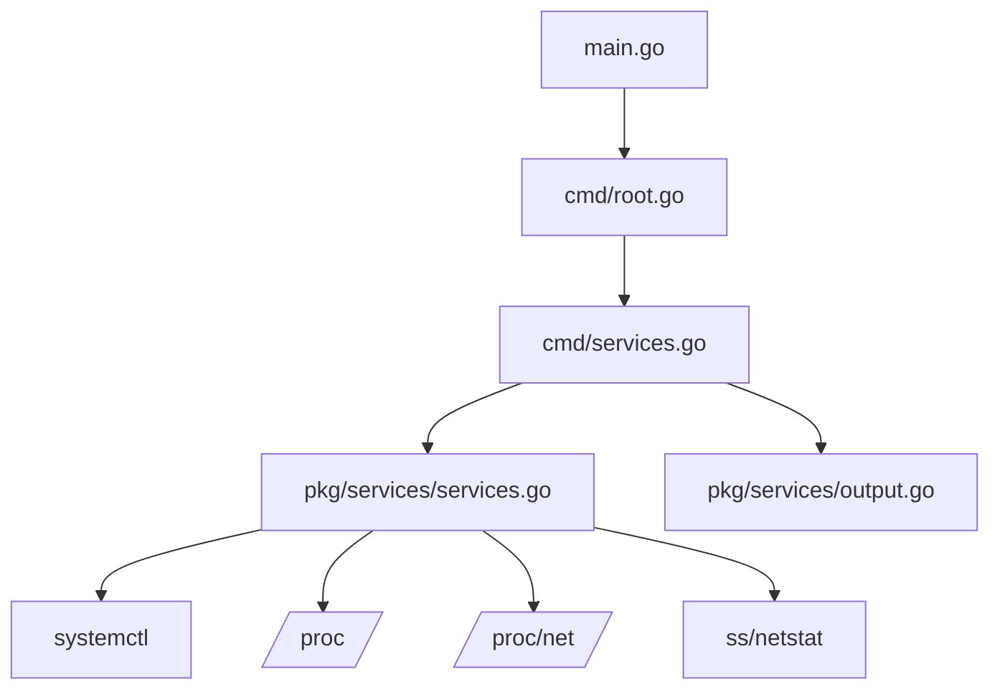

# Services Information Tool Implementation Plan

## Overview
Add a new CLI tool to display services running on the machine, including daemons and web services that bind to ports. The tool will follow the same architectural pattern as the existing battery, disk, cpu, and gpu tools.

## Architecture



## Data Structures

### ServiceInfo Struct
```go
type ServiceInfo struct {
    Name            string    `json:"name"`              // Service name
    Description     string    `json:"description"`       // Service description
    Status          string    `json:"status"`            // Service status (running, stopped, failed)
    Loaded          string    `json:"loaded"`            // Loaded state
    Active          string    `json:"active"`            // Active state
    SubState        string    `json:"subState"`          // Sub state
    PID             int       `json:"pid"`               // Process ID
    MemoryMB        float64   `json:"memoryMB"`          // Memory usage in MB
    CPUPercent      float64   `json:"cpuPercent"`        // CPU usage percentage
    StartTime       string    `json:"startTime"`         // Process start time
    Uptime          string    `json:"uptime"`            // Process uptime
    User            string    `json:"user"`              // User running the service
    Command         string    `json:"command"`           // Command line
    ListeningPorts  []PortInfo `json:"listeningPorts"`   // Listening ports
    Type            string    `json:"type"`              // Service type (systemd, process, socket)
}

type PortInfo struct {
    Protocol    string `json:"protocol"`    // tcp, tcp6, udp, udp6
    LocalAddr   string `json:"localAddr"`   // Local address (e.g., 0.0.0.0:80)
    Port        int    `json:"port"`        // Port number
    State       string `json:"state"`       // Port state (LISTEN, etc.)
    ProcessName string `json:"processName"` // Process name
    PID         int    `json:"pid"`         // Process ID
}

type ServicesSummary struct {
    TotalServices  int `json:"totalServices"`   // Total services found
    Running        int `json:"running"`         // Running services
    Stopped        int `json:"stopped"`         // Stopped services
    Failed         int `json:"failed"`          // Failed services
    TotalPorts     int `json:"totalPorts"`      // Total listening ports
    Services       []ServiceInfo `json:"services"`
}
```

## Implementation Steps

### Step 1: Create pkg/services/services.go
Create the core services reading logic with the following components:

1. **ServicesReader struct** - Main reader for services information
   - `systemctlPath: /usr/bin/systemctl`
   - `procPath: /proc/`
   - `procNetPath: /proc/net/`

2. **Methods to implement:**
   - `ReadAllServices() (*ServicesSummary, error)` - Read all services information
   - `ReadSystemdServices() ([]ServiceInfo, error)` - Read systemd services
   - `ReadServiceByName(name string) (*ServiceInfo, error)` - Read specific service
   - `ReadProcessServices() ([]ServiceInfo, error)` - Read process-based services
   - `ReadListeningPorts() ([]PortInfo, error)` - Read listening ports from /proc/net
   - `GetProcessInfo(pid int) (*ProcessInfo, error)` - Get process information
   - `MatchPortsToServices(services []ServiceInfo, ports []PortInfo)` - Match ports to services

3. **Helper methods:**
   - `parseSystemctlOutput(output string) ([]ServiceInfo, error)`
   - `parseProcStat(pid int) (*ProcessStat, error)`
   - `parseProcStatus(pid int) (*ProcessStatus, error)`
   - `parseProcCmdline(pid int) (string, error)`
   - `parseProcNetTcp() ([]PortInfo, error)`
   - `parseProcNetUdp() ([]PortInfo, error)`
   - `formatUptime(startTime int64) string`
   - `formatStartTime(startTime int64) string`
   - `getMemoryMB(pid int) (float64, error)`
   - `getCPUPercent(pid int) (float64, error)`

### Step 2: Create pkg/services/output.go
Create output formatting logic:

1. **OutputFormat type** - Table and JSON formats (same as other tools)

2. **Functions to implement:**
   - `Print(summary *ServicesSummary, format OutputFormat) error`
   - `PrintTable(summary *ServicesSummary)` - Human-readable table with colors and emojis
   - `PrintJSON(summary *ServicesSummary) error` - JSON output

3. **Helper functions:**
   - `getStatusColor(status string) *color.Color` - Color based on service status
   - `getStatusIcon(status string) string` - Emoji based on service status
   - `getProtocolIcon(protocol string) string` - Emoji based on protocol
   - `printField()` - Consistent field formatting
   - `formatMemory(mb float64) string` - Format memory usage
   - `formatCPU(percent float64) string` - Format CPU usage

### Step 3: Create cmd/services.go
Create the CLI command:

1. **Command flags:**
   - `--format, -f` - Output format (table|json)
   - `--name, -n` - Filter by service name
   - `--status, -s` - Filter by status (running|stopped|failed)
   - `--user, -u` - Filter by user
   - `--port, -p` - Filter by port number
   - `--show-ports` - Show listening ports for each service
   - `--show-all` - Show all services including stopped ones
   - `--systemd-only` - Show only systemd services

2. **Command logic:**
   - Read all services information
   - Optionally filter based on flags
   - Display in requested format

### Step 4: Update cmd/root.go
- Add services command to rootCmd using `rootCmd.AddCommand(servicesCmd)`

### Step 5: Update README.md
- Add documentation for the new services command
- Include usage examples
- Show table and JSON output formats
- Document all command flags

## Table Output Format Example

```
  🛠️  Services Information

  📋 Summary
  ────────────────────────────────────────
  Total Services:    15
  Running:           12
  Stopped:           2
  Failed:            1
  Listening Ports:   8

  🔄 Running Services
  ─────────────────────────────────────────────────────────────────────────────────────────────────────
  NAME              STATUS    PID    MEMORY    CPU    START TIME      USER      PORTS
  ─────────────────────────────────────────────────────────────────────────────────────────────────────
  🟢 sshd           running   1234   12.3 MB   0.1%   Jan 15 09:30    root      :22/tcp
  🟢 nginx          running   2345   45.6 MB   0.5%   Jan 15 09:31    nginx     :80/tcp, :443/tcp
  🟢 docker         running   3456   234.5 MB  1.2%   Jan 15 09:32    root      :2375/tcp
  🟢 systemd-journald running  4567   8.2 MB    0.0%   Jan 15 09:30    root      -
  🟢 cron           running   5678   2.1 MB    0.0%   Jan 15 09:30    root      -
  🟢 NetworkManager running   6789   34.5 MB   0.3%   Jan 15 09:30    root      -
  ─────────────────────────────────────────────────────────────────────────────────────────────────────

  🔴 Failed Services
  ─────────────────────────────────────────────────────────────────────────────────────────────────────
  NAME              STATUS    PID    MEMORY    CPU    START TIME      USER      PORTS
  ─────────────────────────────────────────────────────────────────────────────────────────────────────
  🔴 my-service     failed    -      -         -      -               root      -
  ─────────────────────────────────────────────────────────────────────────────────────────────────────

  ⏸️  Stopped Services
  ─────────────────────────────────────────────────────────────────────────────────────────────────────
  NAME              STATUS    PID    MEMORY    CPU    START TIME      USER      PORTS
  ─────────────────────────────────────────────────────────────────────────────────────────────────────
  ⏸️  backup-service stopped   -      -         -      -               root      -
  ⏸️  test-service   stopped   -      -         -      -               root      -
  ─────────────────────────────────────────────────────────────────────────────────────────────────────
```

## Detailed Service Output Example (--show-ports)

```
  🛠️  Service Details: nginx

  📋 General Info
  ────────────────────────────────────────
  Name:              nginx
  Description:       A high performance web server and a reverse proxy server
  Status:            🟢 running
  Loaded:            loaded
  Active:            active
  Sub State:         running
  Type:              systemd

  📊 Process Info
  ────────────────────────────────────────
  PID:               2345
  User:              nginx
  Memory:            45.6 MB
  CPU:               0.5%
  Start Time:        Jan 15 09:31:15
  Uptime:            5 days, 2 hours, 15 minutes
  Command:           nginx: master process /usr/sbin/nginx -g daemon off;

  🌐 Listening Ports
  ────────────────────────────────────────
  🟢 tcp  0.0.0.0:80    LISTEN   nginx (2345)
  🟢 tcp  0.0.0.0:443   LISTEN   nginx (2345)
  🟢 tcp6 [::]:80       LISTEN   nginx (2345)
  🟢 tcp6 [::]:443      LISTEN   nginx (2345)
```

## JSON Output Format Example

```json
{
  "totalServices": 15,
  "running": 12,
  "stopped": 2,
  "failed": 1,
  "totalPorts": 8,
  "services": [
    {
      "name": "sshd",
      "description": "OpenSSH server daemon",
      "status": "running",
      "loaded": "loaded",
      "active": "active",
      "subState": "running",
      "pid": 1234,
      "memoryMB": 12.3,
      "cpuPercent": 0.1,
      "startTime": "Jan 15 09:30:00",
      "uptime": "5 days, 2 hours, 30 minutes",
      "user": "root",
      "command": "sshd: /usr/sbin/sshd -D [listener] 0 of 10-100 startups",
      "listeningPorts": [
        {
          "protocol": "tcp",
          "localAddr": "0.0.0.0:22",
          "port": 22,
          "state": "LISTEN",
          "processName": "sshd",
          "pid": 1234
        }
      ],
      "type": "systemd"
    },
    {
      "name": "nginx",
      "description": "A high performance web server and a reverse proxy server",
      "status": "running",
      "loaded": "loaded",
      "active": "active",
      "subState": "running",
      "pid": 2345,
      "memoryMB": 45.6,
      "cpuPercent": 0.5,
      "startTime": "Jan 15 09:31:15",
      "uptime": "5 days, 2 hours, 15 minutes",
      "user": "nginx",
      "command": "nginx: master process /usr/sbin/nginx -g daemon off;",
      "listeningPorts": [
        {
          "protocol": "tcp",
          "localAddr": "0.0.0.0:80",
          "port": 80,
          "state": "LISTEN",
          "processName": "nginx",
          "pid": 2345
        },
        {
          "protocol": "tcp",
          "localAddr": "0.0.0.0:443",
          "port": 443,
          "state": "LISTEN",
          "processName": "nginx",
          "pid": 2345
        }
      ],
      "type": "systemd"
    }
  ]
}
```

## Color Schemes

### Service Status
| Status | Icon | Color |
|--------|------|-------|
| running | 🟢 | Green |
| active | 🟢 | Green |
| stopped | ⏸️ | Yellow |
| inactive | ⏸️ | Yellow |
| failed | 🔴 | Red |
| dead | 🔴 | Red |
| unknown | ❓ | White |

### Protocol Icons
| Protocol | Emoji |
|----------|-------|
| tcp | 🟢 |
| tcp6 | 🟢 |
| udp | 🔵 |
| udp6 | 🔵 |

## Linux System Information Sources

### systemctl (systemd services)
- `systemctl list-units --type=service --all` - List all services
- `systemctl show <service>` - Show detailed service info
- `systemctl status <service>` - Show service status

### /proc/[pid]/
- `/proc/[pid]/stat` - Process status (PID, state, CPU time)
- `/proc/[pid]/status` - Process detailed status (memory, user)
- `/proc/[pid]/cmdline` - Command line arguments
- `/proc/[pid]/statm` - Memory statistics
- `/proc/[pid]/fd/` - File descriptors

### /proc/net/
- `/proc/net/tcp` - TCP socket connections
- `/proc/net/tcp6` - TCP6 socket connections
- `/proc/net/udp` - UDP socket connections
- `/proc/net/udp6` - UDP6 socket connections

### /proc/[pid]/net/
- `/proc/[pid]/net/tcp` - Process-specific TCP connections
- `/proc/[pid]/net/udp` - Process-specific UDP connections

## Dependencies
No new dependencies required. Uses only standard library and existing:
- `github.com/spf13/cobra` (already in go.mod)
- `github.com/fatih/color` (already in go.mod)
- `os/exec` - For running systemctl commands
- `os` - For reading /proc filesystem

## Files to Create/Modify

### New Files:
1. `pkg/services/services.go` - Core services reading logic
2. `pkg/services/output.go` - Output formatting
3. `cmd/services.go` - Services command
4. `plans/services-cli-plan.md` - This plan file

### Files to Modify:
1. `cmd/root.go` - Add services command to root
2. `README.md` - Update documentation

## Usage Examples

```bash
# Display all running services in table format (default)
linux-toolkit services

# Display all services including stopped ones
linux-toolkit services --show-all

# Display services in JSON format
linux-toolkit services --format json

# Show services filtered by status
linux-toolkit services --status running
linux-toolkit services --status failed

# Show service by name
linux-toolkit services --name nginx

# Show services filtered by user
linux-toolkit services --user nginx

# Show services listening on specific port
linux-toolkit services --port 80

# Show detailed port information
linux-toolkit services --show-ports

# Show only systemd services
linux-toolkit services --systemd-only

# Combine options
linux-toolkit services --status running --show-ports --format json

# Show help
linux-toolkit services --help
```

## Command Options

| Flag | Short | Description | Default |
|------|-------|-------------|---------|
| `--name` | `-n` | Filter by service name (supports wildcard) | all |
| `--status` | `-s` | Filter by status (running|stopped|failed) | all |
| `--user` | `-u` | Filter by user | all |
| `--port` | `-p` | Filter by port number | all |
| `--show-ports` | - | Show listening ports for each service | false |
| `--show-all` | `-a` | Show all services including stopped ones | false |
| `--systemd-only` | - | Show only systemd services | false |
| `--format` | `-f` | Output format (table|json) | table |
| `--help` | `-h` | Help for services command | - |

## Testing Considerations
- Test on systems with systemd
- Test on systems with many services
- Test with services that have multiple listening ports
- Test with services that have no listening ports
- Test filtering by name, status, user, and port
- Test JSON output parsing
- Test with failed services
- Test with stopped services
- Test memory and CPU calculation accuracy
- Test port matching accuracy
- Test with IPv4 and IPv6 sockets

## Edge Cases to Handle
- systemctl not available (non-systemd systems)
- Permission denied when reading /proc files
- Services with no PID (stopped/failed)
- Services with multiple PIDs
- Ports with no associated process
- IPv6 addresses in /proc/net output
- Long command lines
- Services with no description
- Services with no user information
- Zombie processes

## Future Enhancements (Optional)
- Support for other init systems (sysvinit, openrc)
- Real-time monitoring mode
- Service restart/start/stop commands
- Service log viewing
- Service dependency tree
- Historical service status
- Alerting for failed services
- Service health checks
